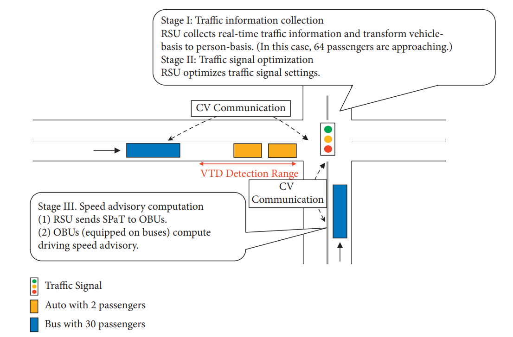
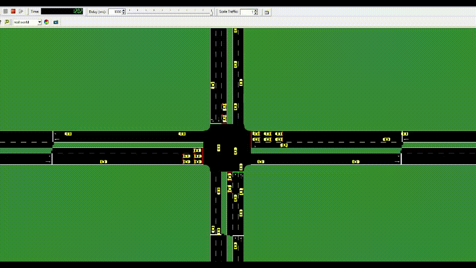

### V2X-based Multi-Modal Traffic Signal Priority Systems in Tainan City 
Tag: Traffic Signal Control, V2X, Traffic Simulation

* System Structure

* I was in charge of designing and implementing core signal priority strategies for 21 signalized intersections.
* Led a group in developing a traffic simulation in SUMO to evaluate traffic impact; the complete evaluation results were presented at the 2022 SUMO User Conference.
    * Chun-Cheng Liang, **Hsuan-Chih Wang***, Wei-Hsun Lee and Ming-Te Wang (2022). Evaluating traffic performance of transit signal priority using SUMO simulation: A real-world case. _2022 SUMO Conference_ .
        * [Presentation video](https://www.youtube.com/watch?v=orrKpgA8jCw)

* The project received the *Highest Distinction Award* and *Outstanding Transportation Project Award* out of 20+ ITS projects in Taiwan from the Ministry of Transportation and Communications and the Chinese Institute of Transportation, respectively

### A Person-Based Adaptive Traffic Signal Control Method with Cooperative Transit Signal Priority (Master's thesis)
Tag: Adaptive Signal Control, Cooperative ITS, Traffic Simulation

* In my master's thesis, I proposed a Person-based Adaptive traffic signal control method with Cooperative Transit signal priority (PACT). In PACT, not only do Road-Side Units (RSUs) perform signal optimization, but also On-Board Units (OBUs) provide in-vehicle speed advisory to reduce delays. The interaction between RSU and OBU is conducted second-by-second, which has high adaptability to traffic variations.

* Published in _Journal of Advanced Transportation_
    * [PDF](https://downloads.hindawi.com/journals/jat/2022/2205292.pdf)
    * [Official Link](https://www.hindawi.com/journals/jat/2022/2205292/)

* Structure

* Simulation

### Signal Phase and Timing (SPaT) Service in Tainan City 
Tag: V2X, Signal Phase and Timing

* As my undergraduate project, I Developed an Android mobile application providing the SPaT information of 1000+ signalized intersections via a traffic signal timing database from the Tainan City Bureau of Transportation. 

### A Study of Applying Eco-Driving Speed Advisory on Transit Signal Priority
Tag: Transit Signal Priority

* A study of integrating speed advisory into Transit Signal Priority (TSP) to reduce bus delays and enhance energy consumption performances. A real electric bus route in Tainan City, Taiwan is used for the case study. Intersection layout and traffic related parameters are established in microscopic traffic simulation software SUMO (Simulation of Urban Mobility) to verify the effectiveness of the proposed model.

