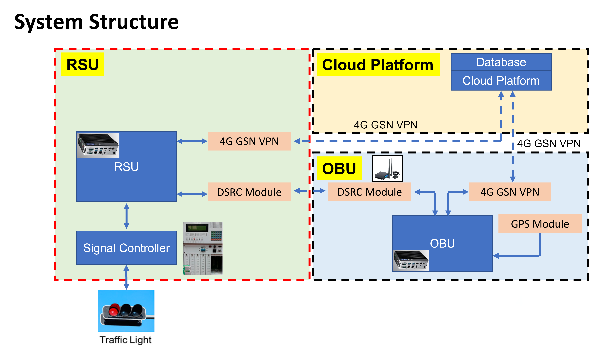
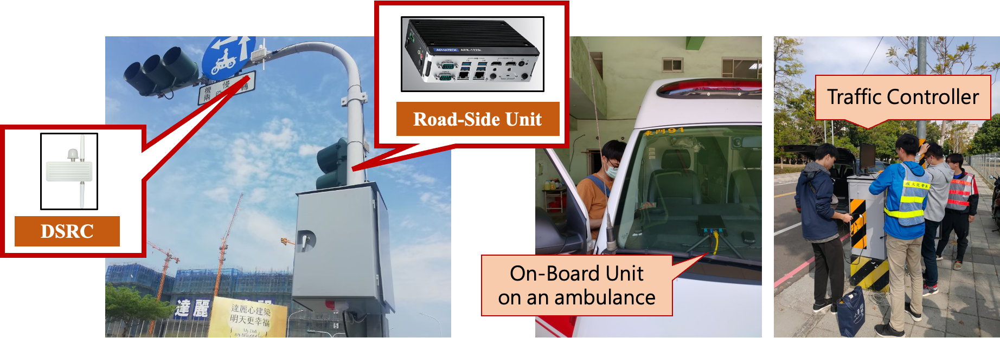

## V2X-based Multi-Modal Traffic Signal Priority Systems in Tainan City 

* Project Date: 2020/09 ~ 2021/12
* Location: Tainan City, Taiwan
* Features:
    * V2X-based multi-modal traffic signal priority (Transit signal priority + Emergency vehicle signal preemption)
    * Details: 
        * Road Side Units (RSUs): 21 Signalized intersections across the urban area.  
        * On-Board Units (OBUs): 9 Electric Buses + 10 Ambulances.
        * The largest scale multi-modal signal control system in Taiwan. 

* Related Publication:
    * Chun-Cheng Liang, **Hsuan-Chih Wang***, Wei-Hsun Lee and Ming-Te Wang (2022). Evaluating traffic performance of transit signal priority using SUMO simulation: A real-world case. _2022 SUMO Conference_ .
        * [Presentation video](https://www.youtube.com/watch?v=orrKpgA8jCw)

