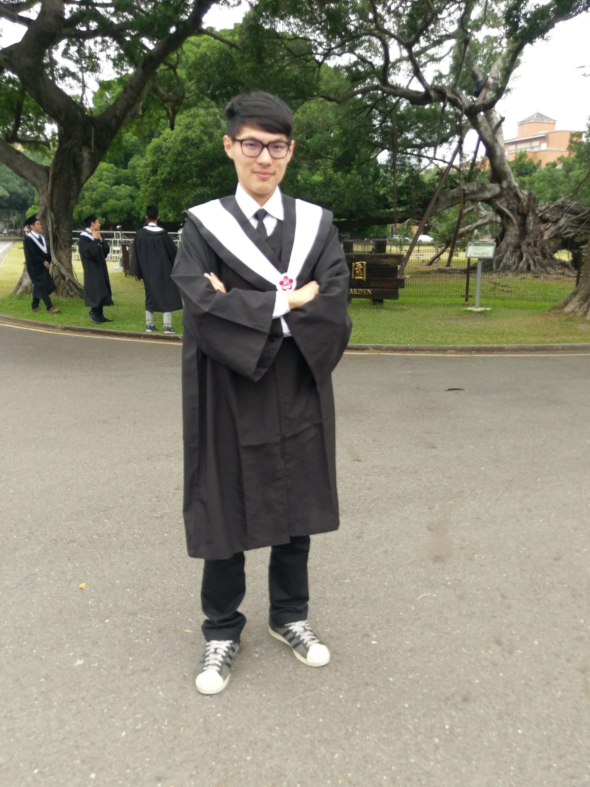

## A V2X-based multi-modal signal prioirty system in Tainan City

**STILL UNDER CONSTRUCTION**

* Project Date: 2020/09 ~ 2021/12
* Location: Tainan City, Taiwan
* Features:
    * 
* Techinical Presentation:
    * Chun-Cheng Liang, **Hsuan-Chih Wang***, Wei-Hsun Lee and Ming-Te Wang (2022). Evaluating traffic performance of transit signal priority using SUMO simulation: A real-world case. _2022 SUMO Conference_ .
        * [Presentation video](https://www.youtube.com/watch?v=orrKpgA8jCw)
* Related Publication:
    * Wei-Hsun Lee and Chi-Yi Chiu (2020). “Design and Implementation of a Smart Traffic Signal Control System for Smart City Applications,” _Sensors_, vol. 20, no. 2, p. 508, Jan. 2020, doi: 10.3390/s20020508.

* Details: 
    * Road Side Units (RSUs): 21 Signalized intersections.  
    * On-Board Units (OBUs): 9 Electric Buses + 10 Ambulances.
    * 

